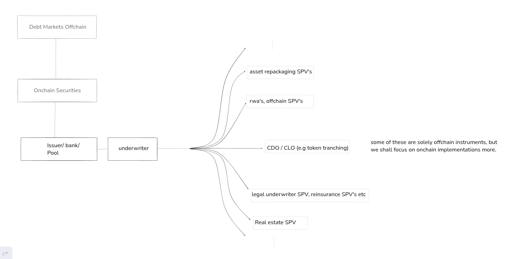

# Hooke-Tranching generalization

This repository is meant to keep a copy of discussions and notes that will progressively contribute to a generic Tranches-waterfall standard for ethereum and overall ecosystem for defi we aim to propose.

## About | Roadmap

The illustration below sketches the broader landscape this work sits in. Off-chain debt markets and on-chain securities feed an issuer, bank, or pool, which routes assets through an underwriter into one of several special-purpose-vehicle constructs — asset-repackaging SPVs, RWA / off-chain SPVs, CDO/CLO token tranching, legal-underwriter and reinsurance SPVs, and real-estate SPVs. Several of these are purely off-chain instruments; this work focuses on the on-chain implementations. Hooke is a simple reusable workflow that is aimed to implement a specefic common kind of SPV out of all these  categories/domains.

Hooke implements the branch highlighted there — CDO/CLO-style token tranching. It takes the mechanic common to the whole underwriting structure — tranching a pool and allocating the resulting claims among the actors involved in the underwriting — and implements it on-chain.

More detailed abstract about the project is mentioned in the notes/ of this very same repository.

 Proposed approaches include writings and discussions on major defi circles and portals (links will be made available in future upon finalizing base research and prototypes) 

This repo is still under development and is half baked with resources and accurate clippings about the research. Future contributions by the maintainer will provide more transparency. 

Actual solidity implementation and experimentation is made available in submodule @Hooke-centrifuge-lender in the very same repository. Note that, this is still work under progress and will major upgrades will be made available only after finalizing the spec. Initial setup is made available for base waterfall scenario with reference of centrifuge's tinlake open experiment (legacy now). Tinlake proved that the Ux actually works with clear and modular placing of the actors involved in the waterfall.  
